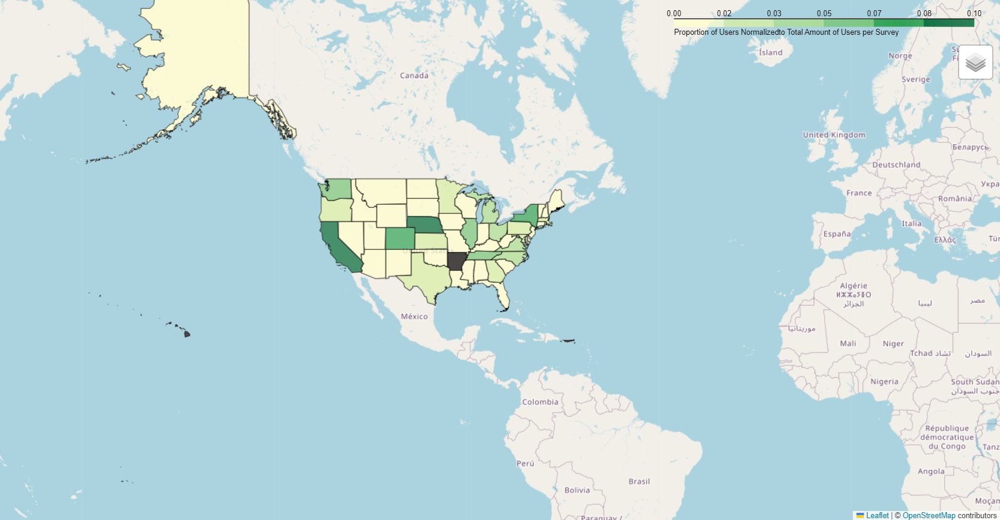

# Mental Health in Tech Industry Analysis
### *author: Celine Ng*
### *April 2024*
 

## Objective
This project analyzes the mental health situation and evolution in the Tech 
industry by examining survey responses from 2014, 2016, 2017, 2018, and 2019. 
Given the large variety of questions and the inconsistent sampling 
population over the years, the analysis focused on key questions to ensure 
a meaningful comparison. The dataset was normalized by 
participant count per survey and hypothesis testing was applied for 
statistical significance.

## Data source
1. [Mental health data](https://www.kaggle.com/datasets/anth7310/mental-health-in-the-tech-industry)
2. US map data: 'cb_2018_us_state_500k'

## Approach & Methodology
For this project, I approached this problem by following a structured 
methodology of Data Cleaning, Data Analysis  
The data is a SQLite database and the project involves using both pandas 
and SQL commands to query the data.
1. Data Cleaning: Check out each table, check for missing values and 
   duplicates.
2. Question Preparation: It was understood that both the surveys 
   and people 
   replying were not the same over the years. To ensure a more comparable 
   results, I prioritized questions that were consistent 
   across surveys. The replies for each of the selected questions 
   were extracted from the dataset, and into a dataframe of its own. Where 
   they are encoded and checked for missing replies.
3. Data Analysis: Some selected questions were 
   personal information (age, etc.), while other were mental health related 
   questions. 
- I analyzed personal questions to understand the sampling population over 
  time, 
   visualizing trends and applying hypothesis testing where necessary.
- I focused on mental health questions to explore the Tech industry’s stance 
  on mental health, comparing responses across industries and genders.

## Results
1. Regarding the policies of mental health in companies, mental health does 
seem to be more supported in the healthcare coverage, with a small dip in 2019. 
Even when disregarding 2014, as it has a relatively different population 
description, around 20% more users responded positively from 2016 to 2019. 
There is also a slight increase (10% without 2014) in anonymity when mental 
health treatment resources are used.

2. With a substantial amount of users not willing to talk about mental 
health in interviews, shows how the majority of the population do not trust
the employers to be reacting in a fair manner.

3. Also, over 20% of the users didn't know if mental health are included, over 
60% of the users are unsure if employers would respect anonymity. Either the
 topics are unimportant for the users, or the users lack trust to even 
 initiate such a conversation.

4. Higher proportion of female users have mental health covered in 
healthcare benefits but male users are open to bring up a mental health issue 
in an interview. This could be due to difference in roles or that although 
in general female are better informed about mental health issues, they 
choose to be more cautious.

5. There is also no clear evidence regarding the industry type. So the tech 
industry does not seem to be less or more 'empathetic' or 'understanding' 
towards this topic, as responses do not change depending on whether users are 
from Tech or not.

**Recommendations:**
-More open conversations and about mental health initiated by the employers.
-Healthcare policies with transparent information about its coverage and 
anonymity treatments to build trust.
-More mental health treatment coverage.
-Ensure healthcare equality across gender and roles.

## US map

